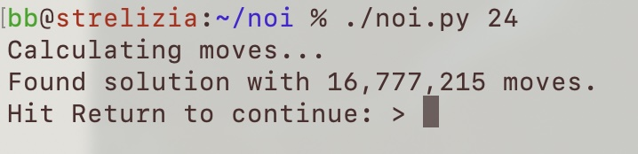

# noi
[Towers of Hanoi](https://en.wikipedia.org/wiki/Tower_of_Hanoi), an animated game simulation using Curses, written in Python3.

Shuffle your Dogecoin, Bitcoin and Cardano/Ada for fun.

## Game

The goal is to move a stack of coins from tower A to tower C, using B as a helper tower.

The catch? You're only allowed to move ONE coin at a time, and NEVER can a larger coin rest on top of a smaller coin.

While you can use regular coins (or "disks") of different sizes such as quarters, nickels and dimes,
it's way more fun to think of them as crypto coins, such as Bitcoin, Dogecoin or Cardano/Ada.

I wish you *much wow* playing the game!

## Rationale
This project was originally a time killer on a long flight with no Internet.
I had an old jailbroken iPad with me on the flight, which I used for coding in Python with the Terminal app.

## Installation

### On Linux, macOS or other Unixes
```
cd ~
git clone git@github.com:bernieblume/noi.git
cd noi
```

### On Windows
Since I'm not a Windows guy, I don't know how installtion works there.

If YOU know, I would appreciate if you can write a quick paragraph and
shoot me a Pull Request.

Thanks so much in advance!

## Usage
`./noi.py <n>`

Will run a Towers of Hanoi simulation for a stack of `n` coins.
If `n` is not given, not numeric, or out of bounds, the maximum possible for the screen size will be assumed.

Noi will resense your screen size each time you start it. So feel free to resize your terminal window and try again.

Please note that for stacks higher than 20 or so, the whole game will take a very long time, and will take up a lot of resources.

When your screen is too large and you don't limit the stack height via command line, your computer might run out of memory.

## Screenshots



## Feedback
This was not just an exercise in getting the task done, but also in being
as elegant and pyhthonic as possible. Let me know where I can improve.
