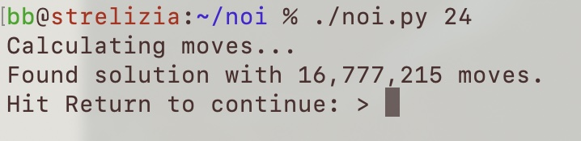
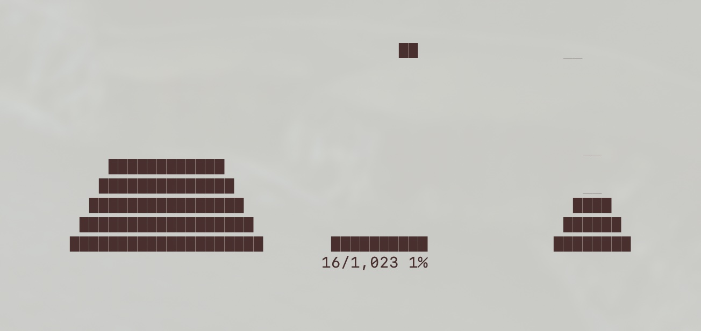

# noi
Towers of Hanoi, animated using Curses, written in Python3

## Rationale
This project was originally a time killer on a long flight with no Internet.
I had an old jailbroken iPad on the flight with terminal access and Python.

## Usage
`./noi.py <n>`

Will run a Towers of Hanoi simulation for a stack of `n` coins.
If `n` is not given, not numeric, or out of bounds, the maximum possible for the screen size will be assumed.

## Screenshots

## Feedback
This was not just an exercise in getting the task done, but also in being
as elegant and pyhthonic as possible. Let me know where I can improve.
